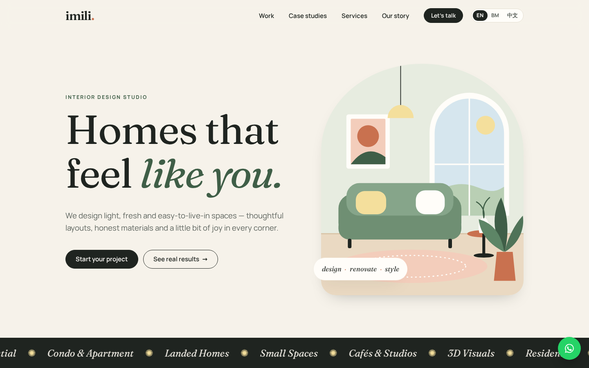
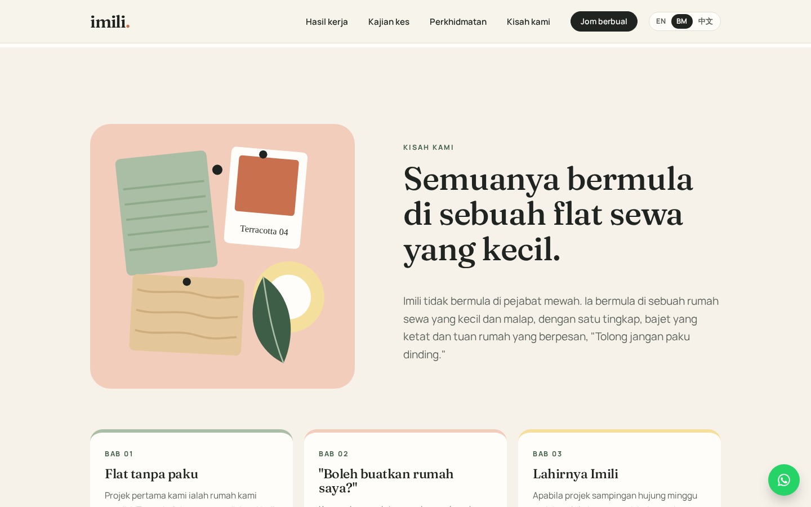
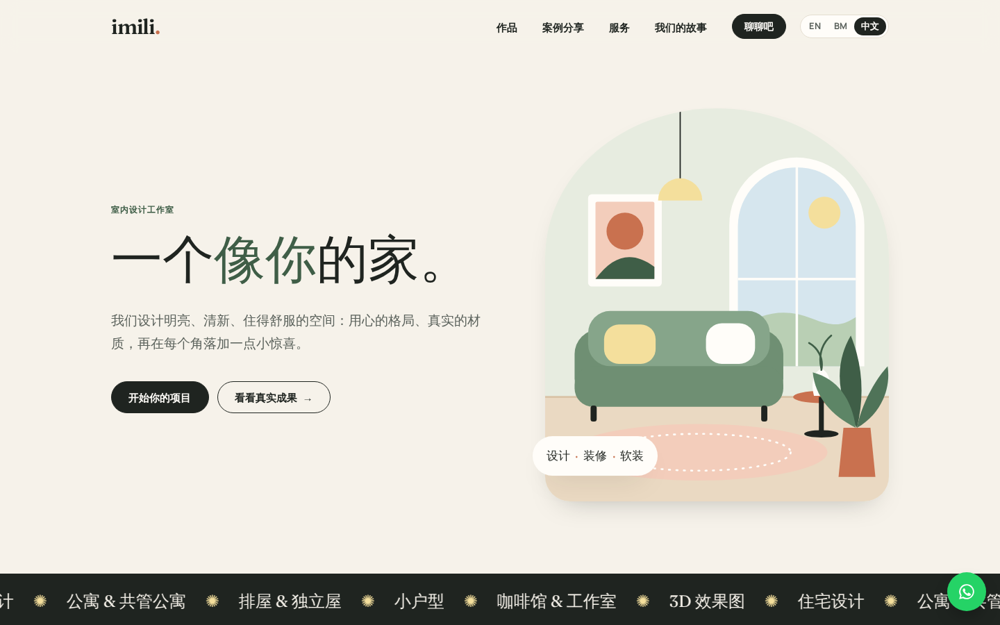

# Imili Design Studio — website

A light, fresh one-page website for **Imili Design Studio** in **English,
Bahasa Melayu and 中文**. It is plain HTML, CSS and JS served by a hardened
nginx container on Google Cloud Run.

| English | Bahasa Melayu | 中文 |
|---|---|---|
|  |  |  |

> **Before launch:** some content is a placeholder, including the case-study
> facts and the founding story. See
> [`docs/CONTENT-CHECKLIST.md`](docs/CONTENT-CHECKLIST.md).

- **Contact:** WhatsApp / call [+60 14-322 3601](tel:+60143223601) ·
  [Instagram](https://www.instagram.com/imilidesignstudio/) ·
  [小红书](https://xhslink.cn/m/60CBuLx36rZ)
- **Languages:** `/` English · `/ms/` Bahasa Melayu · `/zh/` 中文. These
  are real pre-rendered pages (good for Google, and they work without
  JavaScript) with a switcher and `hreflang` links.
- **Sections:** hero · selected work (filterable) · **case studies**
  (before/after slider, brief → what we did → result) · services · process
  · **our story** · FAQ · WhatsApp enquiry form
- **No third-party requests.** Fonts (Fraunces + Manrope, SIL OFL),
  illustrations, CSS and JS are all self-hosted, so the site runs no
  trackers and works under a strict Content-Security-Policy.

## Project layout

```
src/index.html        page template ({{key}} placeholders)
src/i18n/en|ms|zh.json  all page text, one file per language
scripts/build.mjs     renders dist/ (one page per language), no dependencies
site/                 shared static files: 404.html, robots.txt,
  assets/css|js|img|fonts
nginx/                server config + security headers
Dockerfile            node build stage → nginx-unprivileged, non-root, port 8080
tests/                Playwright: qa, i18n (languages/case studies/story), security
.github/workflows/    CI/CD: test → publish to GHCR → deploy to Cloud Run
docs/
  requirements/       brief, design research, requirement IDs
  qa/                 QA report
  pentest/            vulnerability / penetration test report
  deploy/             one-time GCP setup (Workload Identity Federation)
```

## Run locally

```bash
docker build -t imili-web .
docker run --rm -p 8080:8080 imili-web
# open http://localhost:8080, /ms/ and /zh/
```

To edit without Docker, run `npm run build && npx serve dist`. It works,
but without the production security headers.

## Test

```bash
npm ci
npx playwright install chromium     # first time only
docker run -d --rm -p 8080:8080 imili-web
npm run lint:html
npm test                            # QA + security, desktop + mobile
BASE_URL=https://<your-cloud-run-url> npm run test:security   # against prod
```

## Deploy

Pushing to `main` deploys automatically, using the same pattern as
`ai-assisted-api` (GitHub Actions → GHCR → Cloud Run with Workload Identity
Federation). **First do the one-time setup in
[`docs/deploy/gcp-cloud-run-setup.md`](docs/deploy/gcp-cloud-run-setup.md).**

## Updating content

**Text (all languages):** edit `src/i18n/en.json`, `ms.json` and `zh.json`.
Change the same key in all three files, then run `npm run build`. The build
refuses to run if a language is missing a string, so nothing ships
half-translated. Text is HTML-escaped automatically. Only keys ending in
`_html` may use `<em>`, `<strong>` or `<br>`.

**Layout:** edit `src/index.html`. When you add a `{{new.key}}`, add it to
all three JSON files.

**Images:** put real photos (JPG/WebP, under 300 KB each) in
`site/assets/img/` and update the `src` in `src/index.html`. For the
before/after slider, use two photos taken from **the same angle**.

**Domain:** once you have one, set the repo variable `SITE_URL` (e.g.
`https://www.imili.my`). The build then adds absolute canonical/hreflang
links and a `sitemap.xml`.

**Phone number:** search for `60143223601` in `src/index.html` and
`site/assets/js/main.js`.

Then run `npm test`, which checks links, filters, the form, every language
and security.
