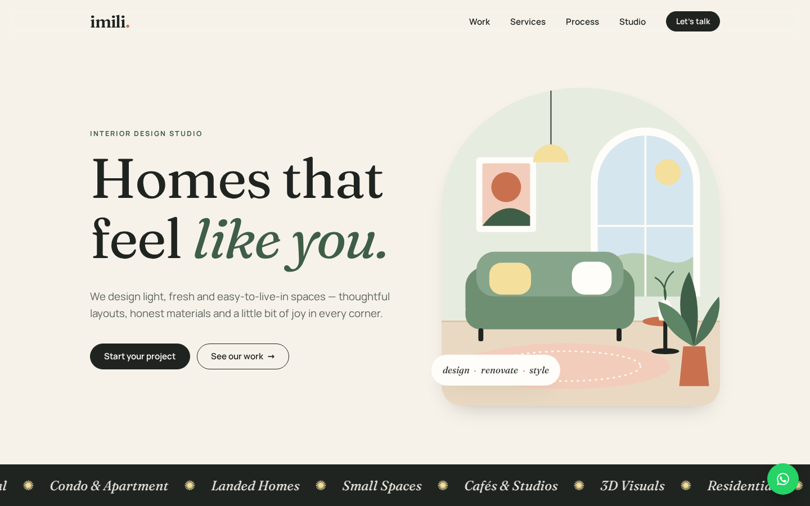

# Imili Design Studio — website

A light, fresh one-page website for **Imili Design Studio**. It is plain
HTML, CSS and JS with no build step, served by a hardened nginx container
on Google Cloud Run.



- **Contact:** WhatsApp / call [+60 14-322 3601](tel:+60143223601) ·
  [Instagram](https://www.instagram.com/imilidesignstudio/) ·
  [小红书](https://xhslink.cn/m/60CBuLx36rZ)
- **Sections:** hero · selected work (filterable) · services · process ·
  studio · FAQ · WhatsApp enquiry form
- **No third-party requests.** Fonts (Fraunces + Manrope, SIL OFL),
  illustrations, CSS and JS are all self-hosted, so the site runs no
  trackers and works under a strict Content-Security-Policy.

## Project layout

```
site/                 the website (deployed as-is)
  index.html, 404.html, robots.txt
  assets/css|js|img|fonts
nginx/                server config + security headers
Dockerfile            nginx-unprivileged, non-root, port 8080
tests/                Playwright QA (qa.spec.js) + security (security.spec.js)
.github/workflows/    CI/CD: test → publish to GHCR → deploy to Cloud Run
docs/
  requirements/       brief, design research, requirement IDs
  qa/                 QA report
  pentest/            vulnerability / penetration test report
  deploy/             one-time GCP setup (Workload Identity Federation)
```

## Run locally

```bash
docker build -t imili-web .
docker run --rm -p 8080:8080 imili-web
# open http://localhost:8080
```

To edit without Docker, `npx serve site` works too, but without the
production security headers.

## Test

```bash
npm ci
npx playwright install chromium     # first time only
docker run -d --rm -p 8080:8080 imili-web
npm run lint:html
npm test                            # QA + security, desktop + mobile
BASE_URL=https://<your-cloud-run-url> npm run test:security   # against prod
```

## Deploy

Pushing to `main` deploys automatically, using the same pattern as
`ai-assisted-api` (GitHub Actions → GHCR → Cloud Run with Workload Identity
Federation). **First do the one-time setup in
[`docs/deploy/gcp-cloud-run-setup.md`](docs/deploy/gcp-cloud-run-setup.md).**

## Updating content

Everything is in `site/index.html`, in plain, commented sections.

- **Real project photos:** put JPG/WebP files (about 1200×1500, under
  250 KB each) in `site/assets/img/`. Then change each project's `src`,
  `alt`, name and meta line in the `#work` section. Set `data-category` to
  `home` or `commercial` so the filter works.
- **Project names, About copy and FAQ** are placeholder text written for a
  young studio, because Instagram and Xiaohongshu couldn't be read from
  the build environment. Replace them with Imili's real projects and story.
- **Phone number:** search for `60143223601`. It appears in `index.html`
  (tel link, wa.me links, JSON-LD) and `assets/js/main.js`
  (`WHATSAPP_NUMBER`).
- After editing, run `npm test`. The tests check that links, filters and
  the enquiry form still work.
